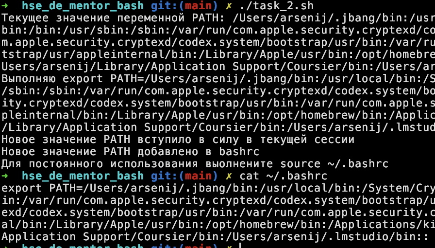
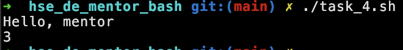
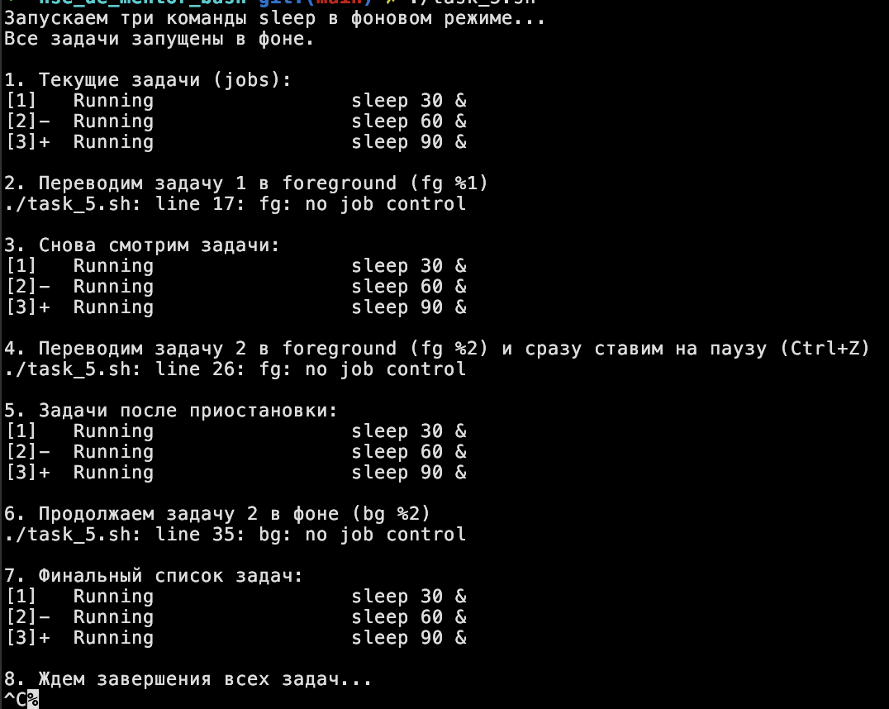
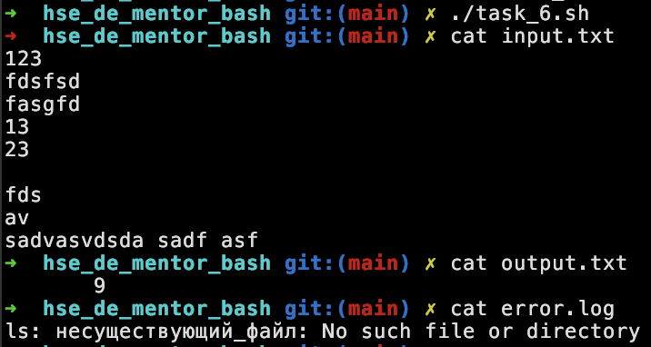

# Задания по bash 

### [Задание 1](task_1.sh)


### [Задание 2](task_2.sh)


### [Задание 3](task_3.sh)


### [Задание 4](task_4.sh)


### [Задание 5](task_5.sh)


### [Задание 6](task_6.sh)


### Задание 7
Чтобы изменения стали постоянными, нужно положить сторку в ~/.bashrc 
```bash
alias ll="ls -al" 
```
